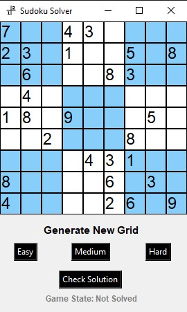

# Python Sudoku Game

### About
A Sudoku game written in Python 3.9 for our Networking and Cybersecurity Python unit class. The code relies on native python libraries tkinter and random for graphics and logic respectively. 
The program's GUI has difficulty options for Easy, Medium and Hard. The harder the difficulty, the less numbers are displayed on the screen, the easier the difficulty, the more 
numbers are displayed on the screen. Once you have solved the sudoku, you can check if you got it right by clicking on the "Check Solution" button where the program checks your
inputs against the correct solution and changes the "Game State" below the Check Solution button accordingly- "Solved" if you solved it correctly and "Incorrect" if you didn't. 
Note that each time you click on the difficulty buttons, a new grid will generate, erasing any progress you made in the prior grid. 

### Installation
**NOTE** The code imports from native Python libraries so no external libraries need to be installed. You just need Python 3.9 on your machine.
1. Go to [Releases](https://github.com/faridfadil/sudoku-solver/releases/tag/v1.0.0)
2. Scroll down and click on **_Sudoku.Game.zip_**
3. Unzip file in preferred directory
4. Navigate to the Main folder
5. Double click on **_main.py_**

### Code Run-down
[Click here for a code run-down video](https://www.youtube.com/watch?v=3zQiK6d5-J8&t=33s)
